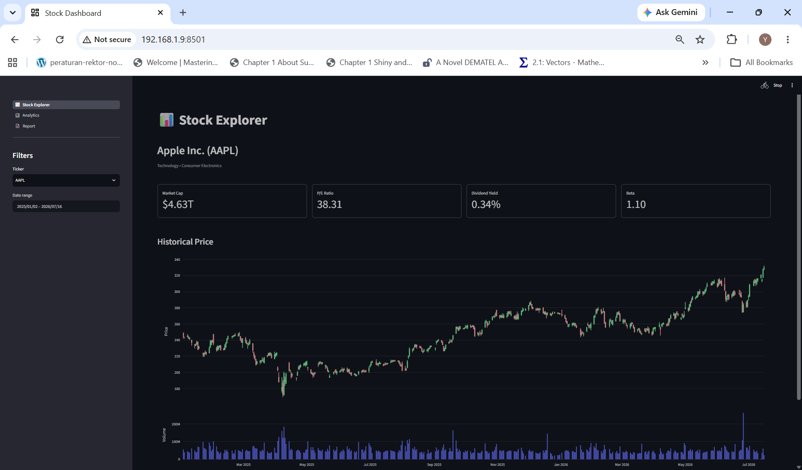
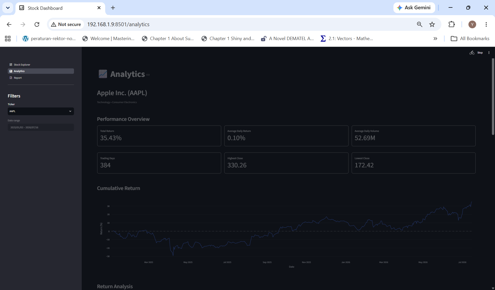
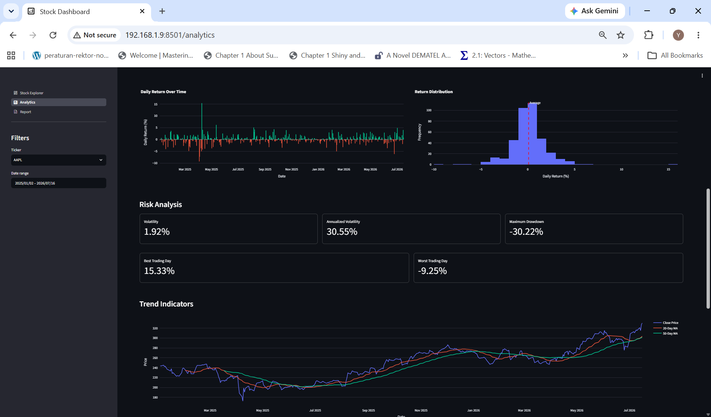
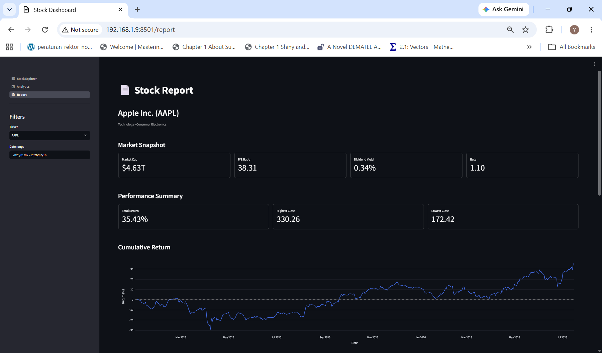
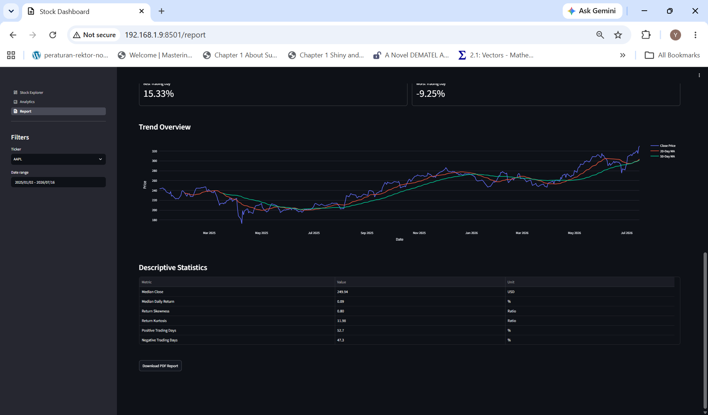

# 📈 Stock Analytics & Financial Intelligence Platform

An interactive stock analytics system for historical price analysis, performance evaluation, risk measurement, statistical exploration, and automated financial reporting.

The system transforms daily market data into structured insights through an end-to-end pipeline including data ingestion, database storage, financial calculations, visualization, and PDF report generation.

---

## 🚀 Live Application

The dashboard is deployed and accessible online:

👉 **[Launch Stock Analytics Dashboard](YOUR_STREAMLIT_APP_URL)**

---

## 🧭 Project Overview

This platform is an end-to-end stock analytics application that integrates:

* Historical market data management
* Financial KPI calculation
* Price trend analysis
* Statistical return analysis
* Risk and volatility analysis
* Trending indicators analysis
* Volume activity analysis
* Interactive visualization
* Automated PDF reporting

It supports both investment research and exploratory financial analysis.

---

## 🏗️ System Architecture

This system follows a layered analytical approach:

```text
Market Data
   │
   ▼
Structured Database
   │
   ▼
Financial Metrics
   │
   ▼
Interactive Analytics
   │
   ▼
Automated Reporting
```

It separates different analytical perspectives:

* What happened (historical prices & performance)
* How it behaved (risk & volatility)
* What patterns exist (statistics & trends)

---

## 🔄 Data Pipeline Architecture

```text
Financial Market Data
        │
        ▼
ETL Pipeline
        │
        ▼
PostgreSQL Database (Supabase)
        │
        ├── Stock Price Table
        ├── Ticker Metadata
        │
        ▼
Selected Stock Dataset
        │
        ├── KPI Engine
        │       ├── Ticker Metadata
        │       ├── Performance Metrics
        │       ├── Risk Metrics
        │       └── Statistical Analysis
        │
        ├── Visualization Layer
        │       ├── Candlestick Chart
        │       ├── Cumulative Return 
        │       ├── Return Analysis 
        │       ├── Trend Indicators
        │       └── Volume Activity
        │
        ▼
Streamlit Dashboard Layer
        │
        ├── Interactive Report
        ├── Charts
        ├── Data Tables
        └── PDF Export
```

---

## ✨ Key Features

### 📊 Historical Price Analysis

* Interactive candlestick visualization
* Daily OHLC price tracking
* Trading volume analysis
* Historical price exploration

### 📈 Performance Analytics

* Total return calculation
* Average daily return
* Average trading volume
* Trading day count
* Highest and lowest closing price

### 📐 Return Analysis

* Cumulative return tracking
* Daily return visualization
* Return distribution histogram

### ⚠️ Risk Analysis

* Daily volatility
* Annualized volatility
* Maximum drawdown
* Best trading day
* Worst trading day

### 📉 Trend Analysis

* Long-term price trend visualization
* Moving average indicators:
  * 20-day moving average
  * 50-day moving average


### 📋 Statistical Exploration

* Median closing price
* Median daily return
* Return skewness
* Return kurtosis
* Positive/negative trading day analysis

### 📄 Automated Reporting

* Generates PDF financial reports
* Includes KPI summaries
* Embeds analytical charts
* Supports downloadable reports

---

## 🧰 Tech Stack

* Python
* Streamlit
* Pandas
* NumPy
* Plotly
* Altair
* PostgreSQL
* Supabase
* SQLAlchemy
* psycopg2
* ReportLab
* Kaleido
* python-dotenv

---

## 🧹 Data Engineering Pipeline

* Retrieves historical stock market data
* Cleans and validates financial records
* Stores structured OHLCV data
* Prevents duplicate records using database constraints
* Uses incremental synchronization logic
* Maintains database consistency through primary keys

---

## 🗄️ Database Design

The application uses PostgreSQL hosted on Supabase.

Main table:

```text
stock_prices

ticker
date
open
high
low
close
volume
```

Primary key:

```text
(ticker, date)
```

This prevents duplicate daily records for the same stock.

---

## 🧠 Analytical Methodology

### Performance Metrics

* Return calculations are based on historical closing prices.
* Daily returns are calculated using percentage change between trading days.

### Risk Metrics

* Volatility measures daily return dispersion.
* Annualized volatility uses 252 trading days.
* Maximum drawdown measures the largest historical decline from peak value.

### Technical Indicators

Moving averages are calculated using rolling windows:

* MA20 → short-term trend
* MA50 → medium-term trend

---

## 📁 Project Structure

```text
StreamlitStockAnalytics/
├── assets/                    # dashboard screenshots
├── components/                # dashboard UI components
├── modules/                   # analytics & visualization modules
│   ├── charts/
│   ├── kpis/
│   ├── reports/
│   └── utils/
├── pages/                     # Streamlit pages
├── scripts/                   # batch jobs (backfill)
├── src/                       # ETL + database layer
│   ├── db/
│   └── etl/
├── app.py                     # main Streamlit application
├── requirements.txt
├── .env.example
└── README.md
```

---

## 📊 Design Philosophy

This system follows a layered analytical approach:

```text
Raw Market Data
      │
      ▼
Structured Financial Data
      │
      ▼
Calculated Metrics
      │
      ▼
Interactive Insights
      │
      ▼
Financial Report
```

It separates analytical perspectives:

* What happened (historical price movement)
* How it performed (returns & KPIs)
* How risky it was (volatility & drawdown)
* What patterns exist (statistics & trends)

---

## 📸 Screenshots

### 📈 Stock Explorer

Stock summary, company information, company KPIs, as well as candlestick chart and trading volume visualization.




### 📊 Analytics Dashboard

Performance, risk, trend, volume, and statistical analysis.




### 📄 Financial Report

Automatically generated analytical report.




---

## ▶️ How to Run Locally

### 1. Install Dependencies

```bash
pip install -r requirements.txt
```

### 2. Configure Environment Variables

Create `.env` based on `.env.example`.

Example:

```env
DB_USER=
DB_PASSWORD=
DB_HOST=
DB_PORT=6543
DB_NAME=postgres
```

### 3. Run Backfill (First-Time Setup)

```bash
python -m scripts.run_financial_backfill
python -m scripts.run_stock_backfill
```

### 4. Start the Streamlit Application

```bash
streamlit run app.py
```

---

## ☁️ Deployment

The application can be deployed using Streamlit Community Cloud.

Database credentials should be configured using Streamlit Secrets:

```toml
DB_USER="your_user"
DB_PASSWORD="your_password"
DB_HOST="your_host"
DB_PORT="6543"
DB_NAME="postgres"
```

Sensitive credentials should never be committed to GitHub.

---

## 👤 Author

**Nurul Yakim Kazal**  
Lecturer, Department of Mathematics, Universitas Sam Ratulangi

Focus areas:

* Numerical Linear Algebra (academic)
* Data engineering & ETL systems
* Financial analytics dashboards
* Interactive data visualization
* Time-series analysis


---

## 🚀 Final Note

This project demonstrates an end-to-end financial analytics system that integrates database engineering, quantitative analysis, interactive visualization, and automated reporting into a unified Streamlit application for exploring stock market behavior.